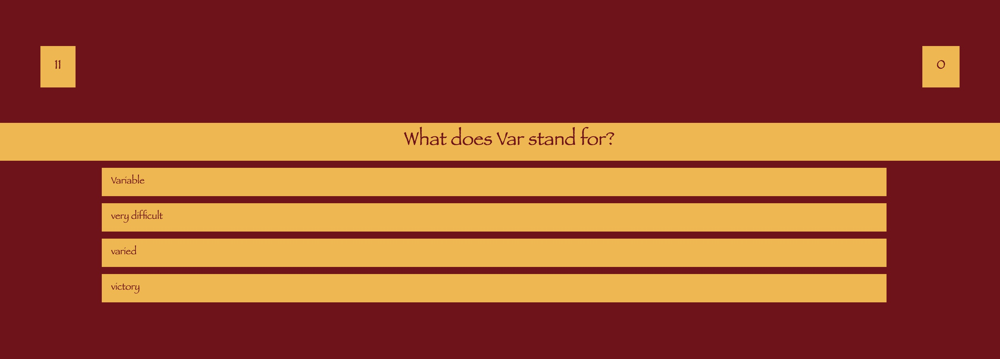

# code_quiz_game
A multiple choice code quiz 

## Acceptance criteria
>GIVEN I am taking a code quiz
>WHEN I click the start button,
>THEN a timer starts and I am presented with a question

I was able to use the `.classList.add()` and `.classList.remove()` to move from the start screen to the quiz to the high score page. 

>WHEN I answer a question,
>THEN I am presented with another question

an `addEventListener` watches for the user input and compares it against the index of the correct answer in the answer array property of the current question. The feedback at the bottom shows a positive or negative message depending on if the answer is correct or not. 

>WHEN I answer a question incorrectly,
>THEN time is subtracted from the clock

a simple if/else statement makes sure that if the user chooses an incorrect answer, the `seconds--` takes an additional second off the timer.

>WHEN all questions are answered or the timer reaches 0,
>THEN the game is over

This again is handled by simple if/else statements.

>WHEN the game is over,
>THEN I can save my initials and score

The high score screen uses the `localStorage` to store the current score and and name. the leaderboard gets the name and score from `localStorage`.

## What I Learned

I found the `classList.add()` and `.remove()` particularly helpful in conjuction with the hide class in my css. It made transitions between screens easy. I also learned more about calling properties of objects in an array. Particularly in combining the correct index number from the `questions.c` in a variable and then comparing it with the user choice in the if/else statement.

## Screenshots

``

## Deployed Application
[Code Quiz Game](https://torysnopl.github.io/code_quiz_game/)

### Source Code

No source code was given, however, I did receive help from askBCS and TA Diego. 